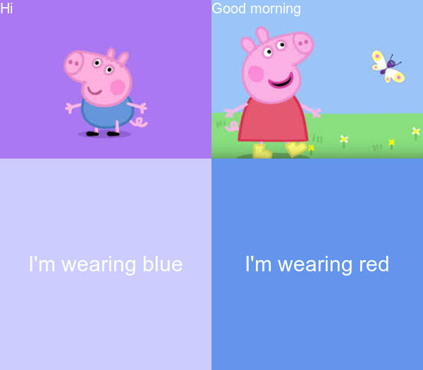

# *Welcome* ✌🏼
Hello! My name is `Danning Kang`. I am an overseas student who is studying online right now.

`Welcome to my website page of stats220 repo! 🥳` 


## Major
<!--- unordered list --->
* *Statistics*
* *communication*

### Favorite rapper 🎤


Her name is **Nicki Minaj**. I really love her songs!
<!--- numbered list --->
1. *Chun-li*
2. *High school*

These two songs are my favorite. You guys can visit to the audios here of [**Chun-li**](https://www.youtube.com/watch?v=XRjZypFORxM) and [**High school**](https://www.youtube.com/watch?v=JTdcgD68J5M) respectively👂🏼

## `R` 
I made a meme by using the R package [{magick}](https://cran.r-project.org/web/packages/magick/vignettes/intro.html):



*Peppa pigs are really cute, right?* 🥰
### Code chunk
```r
library(magick)

# Giving image1 name
pig_in_blue <- image_read(path = "https://encrypted-tbn0.gstatic.com/images?q=tbn:ANd9GcSlNRJ5Q4doVtUnS2Dm50Dj9pnlQXAo3Add0A&usqp=CAU")%>%
  image_scale(300)%>%
# Annotating on the image1  
  image_annotate(text = "Hi", size = 20, color = "#FDFEFE")

# Giving image2 name
pig_in_red <- image_read("https://encrypted-tbn0.gstatic.com/images?q=tbn:ANd9GcTSreyiMnzZPLic9Paopz3DSRODU_PMfUtyrA&usqp=CAU")%>%
  image_scale(300)%>%
# Annotating on the image2
  image_annotate(text = "Good morning",size = 20, color = "#FDFEFE")

# Creating a image and annotating it
intro1 <- image_blank(width = 300, height = 300, color = "#CCCCFF")%>%
  image_annotate(text = "I'm wearing blue", color = "#FDFEFE", size = 30, gravity = "center")

intro2 <- image_blank(width = 300, height = 300, color = "#6495ED")%>%
  image_annotate(text = "I'm wearing red",  color = "#FDFEFE", size = 30, gravity = "center")

# Combining the images with corresponding annotations
blue_pig <- c(pig_in_blue, intro1) %>%
  image_append(stack = TRUE)

red_pig <- c(pig_in_red, intro2) %>%
  image_append(stack = TRUE)

# Combining together
meme = c(blue_pig, red_pig)%>%
  image_append()

# Saving the image
image_write(meme, "my_meme.png")

```
